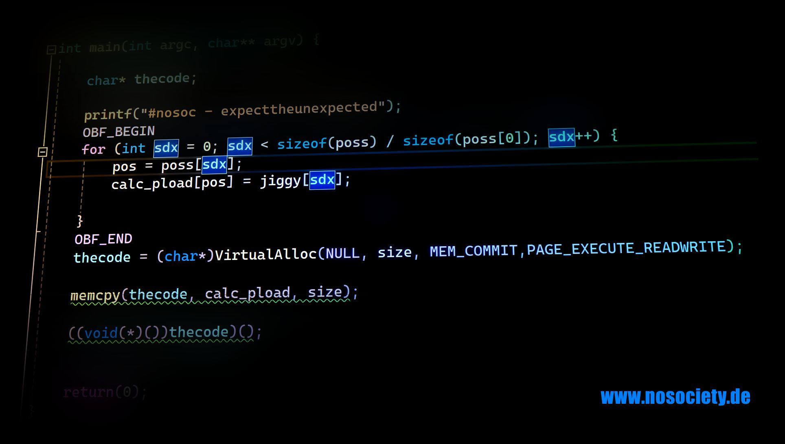

# Shellcode Injection Part 1

This is the source for the first shellcode injection tutorial. It is a local injection with obfuscated shellcode and junk code creation at compile time.

Blogpost: will be ready soon...

## Dependencies

The obfuscation depends on [RedSiege's Jigsaw](https://github.com/RedSiege/Jigsaw) and [fritzone's Obfy](https://github.com/fritzone/obfy)
