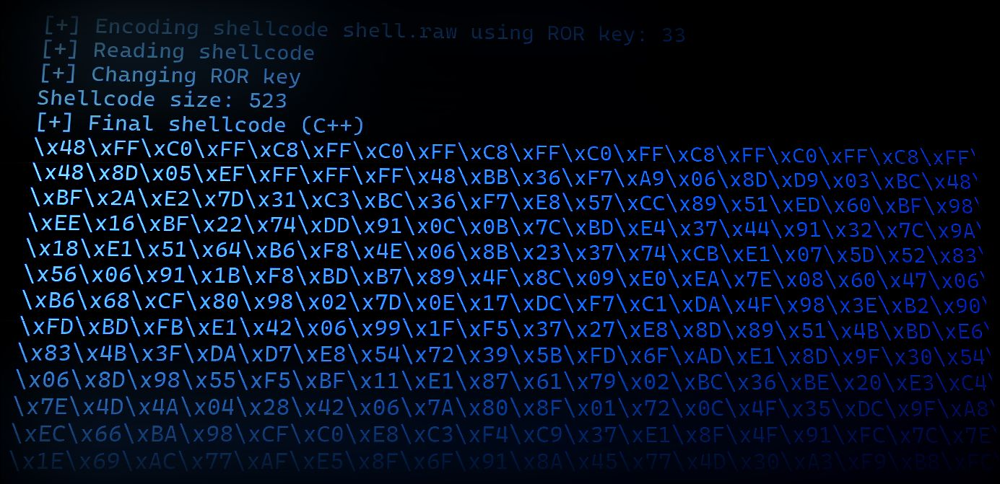

# Shellcode Injection Part 2

This is the second shellcode injection tutorial. We use some obfuscation methods for Defender Evasion and inject our shellcode in our target process.

Blogpost: [https://www.nosociety.de/en:it-security:blog:shellcode_injection-2](https://www.nosociety.de/en:it-security:blog:shellcode_injection-2)

## Dependencies

- [RedSiege's Jigsaw](https://github.com/RedSiege/Jigsaw)
- [fritzone's Obfy](https://github.com/fritzone/obfy)
- https://www.bordergate.co.uk/function-name-hashing/
