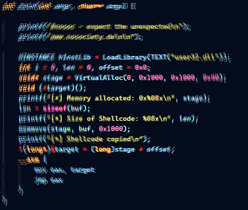

# Shellcode Injection Part 3

Welcome to part 3! This writeup explains how to download and execute a python meterpreter script to spawn a reverse shell. The download and execute process is done by shellcode and can be used with local or remote injection techniques.

Blogpost: [https://www.nosociety.de/en:it-security:blog:shellcode_injection-3](https://www.nosociety.de/en:it-security:blog:shellcode_injection-3)
