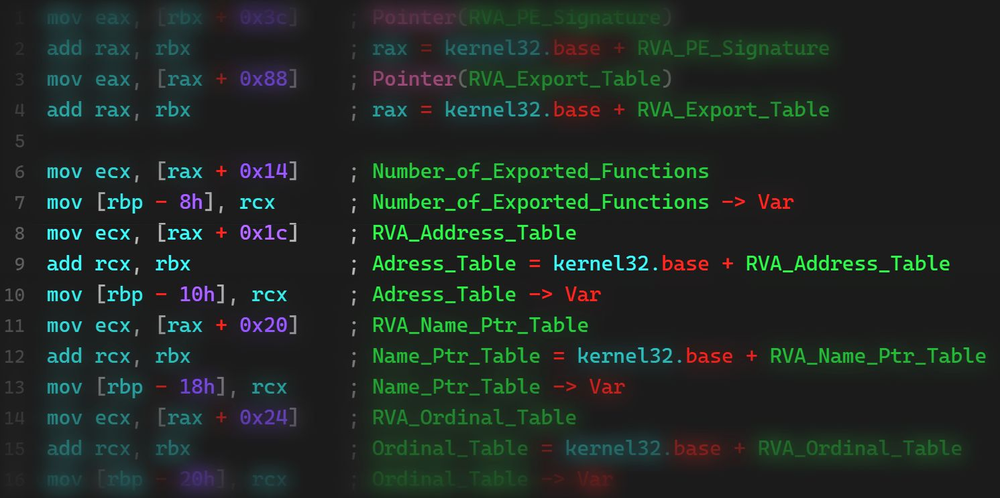

# Shellcode Injection Part 4

Welcome to part 4! We will analyze a calc.exe payload, which uses WinAPI for execution.

Blogpost: [https://www.nosociety.de/en:it-security:blog:shellcode_injection-4](https://www.nosociety.de/en:it-security:blog:shellcode_injection-4)
